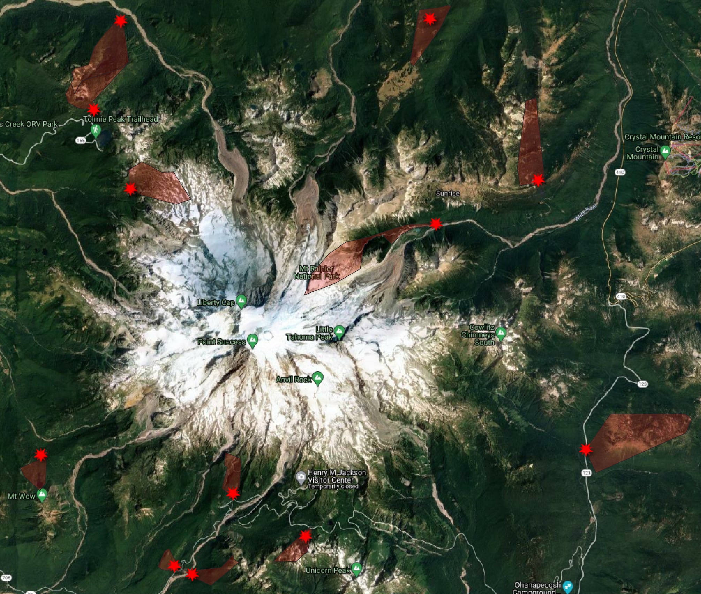

# mora-people-mora-problems
Using geoteagged-social media and other Predictors as Proxies in Quantifying Visitation in Mount Rainier National Park 

### Introduction

The Western United States has seen historic growth in the last decade. This growth has translated into unequaled use of public lands for recreation, creating pressures on some of their most fragile ecosystems. One of those fragile ecosystems are alpine lakes which punctuate much of the high-elevation cryosphere and draw concentrated patronage from backcountry recreationists. These visitors have been leaving behind levels of human waste, specifically feces, that has outpaced in-place waste mitigation apparatus currently maintained by land managers. The two basic components required to begin understanding the level of this impact is identifying if there is a human-specific fecal contribution to alpine lakes and how many people are using these lakes. To help quantify the intensity of use in these remote locations a visitation model created by Spencer Wood in the Mount Baker-Snoqualmie National Forest (MBS) was tested on Mount Rainier National Park(MORA). This MBS model uses geotagged social media data, and other predictors, as a proxy for estimating visitation. Geotagged social media posts scraped from MORA were used in conjunction with the MBS model to predict visitation at specific sites around the park. The hope is to create a modeling tool for MORA and if successful, expand the model's predictive ability into other national parks

### Site Selection

Trail count data from MORA were selected on two primary conditions. Was (1) the trail one that allowed the infrared counter to all traffic, essentially out-and-back trails, and (2) was the data within the last six years (2015-2020). Polygons were drawn to reflect the areas that would capture all visitors logged by infrared counters. These polygons would then provide the boundaries for social media posts associated with counter data.

### Preliminary Results

The on-site counts and social media posts for each site within MORA were then used to test the ability of a visitation model, parameterized in Mount Baker-Snoqualmie National Forest (Wood, et al. 2020), to predict visitation at similar sites within the National Park. Model 1 was created using MBS data and tested using only MORA data onsite counts. Model 2 was built using MBS data dn ⅓ of the available data from MORA and tested with the other ⅔ of MORA count data (Tbl. 1). Model 1 had an average Pearson’s of 0.58 and an R-squared of 0.34 and model 2  had a Pearson’s of 0.64 and an R-squared of 0.41 (n=1000). There was no statistical difference between models 1 and 2. Model 3 had a Pearson’s of 0.80 and an R-squared of 0.64. Model 3is showing a high correlation between weekly on-site counts and weekly predictions. The next steps are to further investigate fit to increase correlation further and implement at other National Parks 

| Model          | Data Build Model      | Efect Type    | Pearson's (n=500) | R-squared (n=500)|
| :------------- | :----------:          | -----------:  | -----------:      | -----------:     |
| 1              | National Forest       | Fixed         | 0.60              | 0.36             |
| 2              | National Forest + 1/3 | Fixed         | 0.62              | 0.38             |
| 3              | National Forest + 1/3 | Mixed         | 0.80              | 0.64             |                                     

